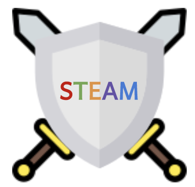
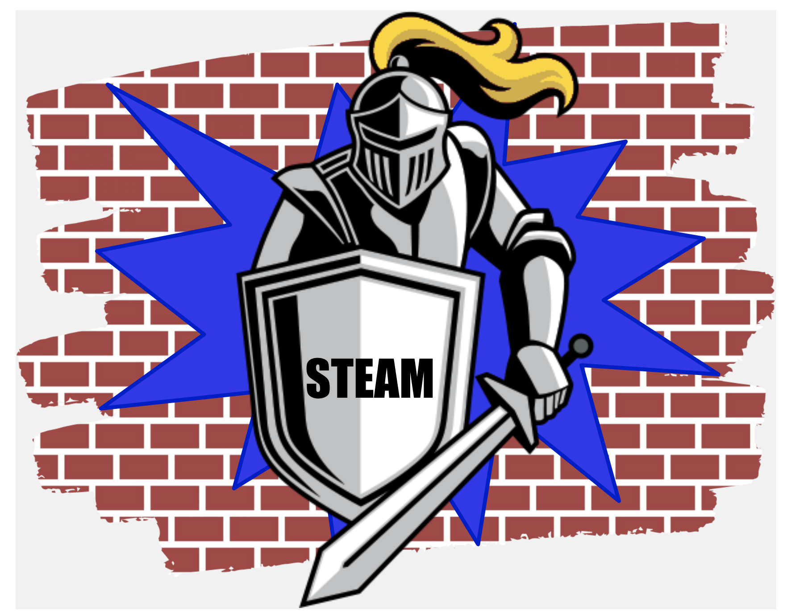

<!DOCTYPE html>
<html>
<head>
  <title>JAMS STEAM</title>
  <link rel="stylesheet" type="text/css" href="style.css">
</head>

<body>

<!--NavBar-->
<ul>
  
  <li><a class="active" href="index.html">JAMS STEAM</a></li>
  <li style="float:right;"><a href="blog.html">Blog</a></li>
  <li style="float:right;"><a href="projects.html">What we are working on</a></li>
  <li style="float:right;"><a href="about.html">About</a></li>
</ul>

 
 
 

<!--Intro Info-->

Hi, we are the

<h1 align="center" style="font-size: 27px; font-family: monaco, monospace;">STEAM Club of JAMS</h1>
<h2 align="center" style="font-size: 21px; font-family: monaco, monospace;">Standing Tall As One</h2>

 

 

<!--Recent Projects-->

<h2 style="font-family: Lucida Grande, sans-serif">Recent Projects</h2>
	

	<!--Recent Projects 1-->

	

	  

	    
	    <h3 style="font-size: 24px; font-family: monaco, monospace"><b> STEAM Projects: Set 1</b></h3> 
	    
What were our first projects? Click to find out!
 
	  

	

 
	
	<h3>See all projects</h3>

 

 

<!--Recent Blogs-->

<h2 style="font-family: Lucida Grande, sans-serif">Recent Blogs</h2>
	

	<!--Recent Blogs 1-->

	

	  

	    
	    <h3 style="font-size: 24px; font-family: monaco, monospace"><b> STEAM Blogs: STEAM!!</b></h3> 
	    
What is STEAM and why is it important to people here at JAMS?
 
	  

	

	 

		<h3>See all blogs</h3>

</body>
</html>
